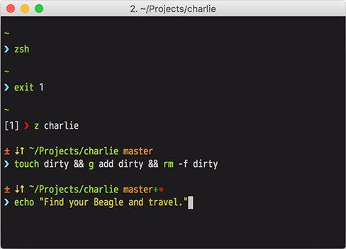

# Charlie

A fish command prompt based on [Charlie for Zsh](https://github.com/c10b10/charlie), and [brandonweiss's Pure port for fish](https://github.com/brandonweiss/pure.fish).



## Features

- Shows the VCS branch and whether it's dirty (with a `*`) or wether it has
staged files (with a `+`).
- Indicates when you have unpushed/unpulled `git` commits with up/down arrows.
- If the command didn't exit with `0`:
    - The prompt character turns red
    - The exit code is displayed before the prompt character
- Username and host only displayed when in an SSH session.
- Shows the current path in the title and the current folder & command when a process is running.
- Makes an excellent starting point for your own custom prompt.
- Has SVN and Mercurial support.
- Shows Python virtualenv info.

## Requirements

Requires git 2.3.0+ and Fish 2.4.0+.

## Installation

Clone in it your fish config directory, and init submodules...

```sh
$ cd ~/.config/fish
$ git clone https://github.com/c10b10/charlie.fish.git
$ cd charlie.fish
$ git submodule init --recursive
```

...and `source` it in `functions/fish_prompt.fish`:

```fish
. ~/.config/fish/charlie.fish/fish_prompt.fish
```

## License

MIT © Alex Ciobica
